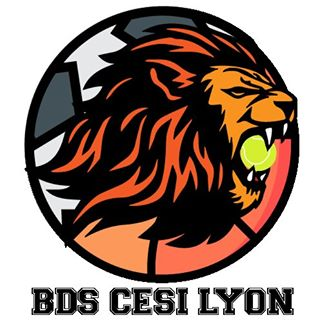
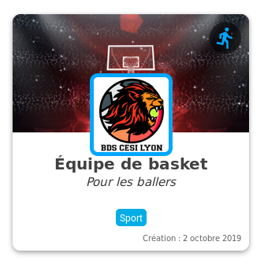

# Bienvenue au BDS

Le Bureau Des Sports est un ensemble d'étudiants qui désirent faire du sport dans le cadre de la vie associative du CESI.
Le BDS est indépendant du BDE dans ses membres et son fonctionnement mais reste en partie financé par ce dernier.

Le BDS encadre toutes les commissions qui en sont dépendantes et qui sont entourée en bleu sur le site. 
Par exemple, la commission Basket ci dessous :

**ATTENTION** contrairement au BDE, tout les étudiants du CESI ne sont pas membres *de facto*. Il faut devenir membre en payant une petite contribution.

## Devenir adhèrent

Pour devenir adhèrent au BDS, il faut contacter l'un des membres du conseil d'administration du BDS et s'aquiter d'une cotisation de 15€ pour l'ensemble de l'année.