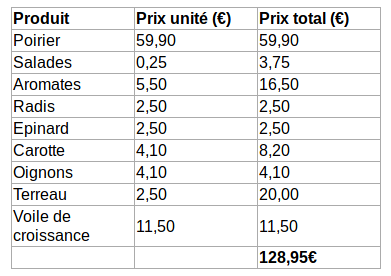

# Demander un financement

Le BDE peut financer tout type de commission.
Mais quelques opérations sont nécéssaires pour demander un financement.

Il est conseillé de commencer la demande de financement dès que tu fixes la date de ton événement.
Plus le montant est important plus il faut faire la demande tôt.
Mais normalmeent nous ne sommes pas trop pointilleux et tu peux faire ta demande de financement jusqu'à la veille 12h avant ton activité.

Selon l'organisation actuelle, c'est le **trésorier** qui est en charge de gérer le financement de la commission.

Il existe 2 types de financement :

* **Le financement indirect** : Dans ce mode de financement, tu disposes d'une promesse de financement; tu avances le coût des activités et tu te fait ensuite rembourser tes dépenses pour un montant inférieur ou égal au montant de la promesse que tu as obtenu.
* **Le financement direct** : Il est réservé aux grosses dépenses que tu ne peux pas avancer. Dans ce modèle, le BDE te donne des fonds que tu peux alors dépenser à ta guise.

## Financement indirect

Le financement indirect s'effectue en deux phases, la première est la demande de promesse de financement et la seconde est le remboursement des dépenses.
Ce genre de financement est préféré car il est simple et rapide à mettre en place.

### 1. Estimer le coût

Cette étape parait longue et fastidieuse mais ce n'est pas le cas.
Dans un premier temps il faut estimer combien coûtera l'activité que tu veux organiser.
Prends en compte chacun des éléments de ton activité (inscription, essence, nourriture, matériel, etc) pour constituer un petit tableau qui récapitule les besoins.

Le tableau ci-dessous est une estimation du coût de la part de la commission potager. 

Quelques liens utiles :

* [Tu peux estimer le prix d'un déplacement en voiture sur Mappy](https://fr.mappy.com/#/21/M2/THome/N-374.56146,-30,4.86265,45.76633/Z12/)

### 2. Contacter le BDE

Envoie un email complet mais concis sur l'ensemble des dépenses que tu prévoies durant l'activité au gérant de la vie associative du BDE (C'est la personne en bas de la barre de gauche).
Inutile de ne mentionner qu'une partie de tes estimations.
Donne tout et on fera notre possible pour en financer le maximum selon les moyens disponibles au BDE.

Tu recevras alors une réponse sur le montant que le BDE est prêt à te rembourser.
C'est la **promesse de financement**.
Le BDE peut alors rembourser, au maximum, le montant de cette promesse.

### 3. Avancer les dépenses

Réalise les dépenses de ta commission comprises dans ton estimation.
**Il est très important de conserver les tickets de tes dépenses ou de demander des factures.**
Ils seront utilisés pour demander le remboursement de tes dépenses.

**ATTENTION** Tu ne peux pas utiliser cheques cadeaux, de ticket restaurants, de cheques voyages pour tes dépenses de vie asso. Garde les pour ton usage perso.

### 4. Demander le remboursement

Envoie un mail au gérant de la vie associative du BDE (C'est la personne en bas de la barre de gauche) pour lui demander de te rembourser.
Il faudra joindre deux choses : 

* Le ticket/facture de ta dépense
* Un RIB de ton compte pour effectuer le remboursement

## Financement direct

Ce type de financement est réservé aux financements plus importants (supérieurs à 200€) que tu ne peux pas avancer.
C'est un type de financement tres flexible mais il faut le prévoir bien en avance parce qu'il faut s'organiser avec le BDE.
Pour demander un financement direct, estime le coût de ta demande et contacte le gérant de la vie associative du BDE (C'est la personne en bas de la barre de gauche).
